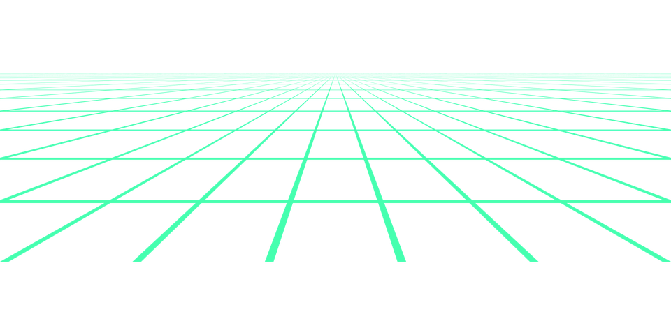

<!-- 
 -->

<!-- 
 -->

<!-- 
 -->

- 📫 How to reach me: rananagy142@gmail.com

# **Skills**

## **DevOps Tools**

  

 
 
 
 
 
 

<h3 align="left">Connect with me:</h3>

<h4 align="center">Visitor's count :eyes:</h4>

